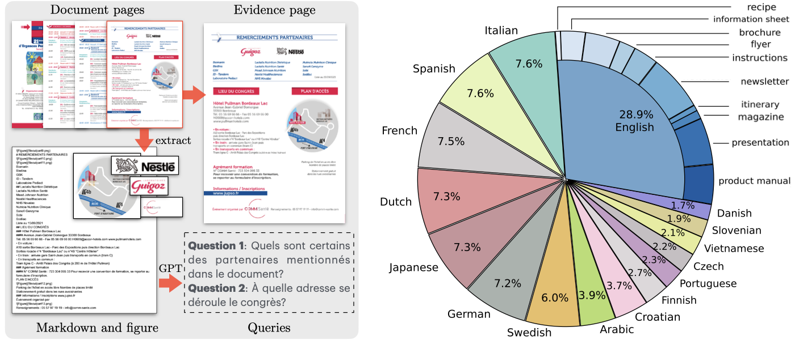

# VisR-Bench

VisR-Bench: A Multilingual Visual Retrieval Benchmark for Long Documents<br />
This repository contains the testing code for evaluating retriever models on the VisR-Bench benchmark.
<br />



## Data Download
The document page images are available in the HuggingFace repository: [puar-playground/VisR-Bench](https://huggingface.co/datasets/puar-playground/VisR-Bench).
```
git lfs install
git clone https://huggingface.co/datasets/puar-playground/VisR-Bench
```
The code above will download the `VisR-Bench` folder, which is required for testing retrieval performance.

QA pairs are provided in the [QA](https://github.com/puar-playground/VisR-Bench/tree/main/QA) folder of this repo.


## Run Test
```
python run_test.py --retriever ColPali --type figure --work_dir .
```

The `retriever` flag determine a retriever model from 
```
['CLIP', 'SigLIP', 'BM25', 'SBERT', 'bge_large', 'BGE_M3', 'VLM2vec', 'VisRAG', 'NV-Embed', 'ColPali', 'ColPhi', 'ColInternVL2', 'GEM'], 
```
The `type` flag determine the type of QA in
```
['figure', 'table', 'text', 'multilingual']
```
`work_dir` specifies the dir to the code folder.


## Reference
```
@inproceedings{chen2025visr,
  title={VisR-Bench: A Visual Retrieval Benchmark for Visually-Rich Documents},
  author={Chen, Jian and Zhang, Ruiyi and Li, Ming and Zhou, Shijie and Chen, Changyou},
  booktitle={ICLR 2025 Workshop on Foundation Models in the Wild}
}

@inproceedings{chen2025svrag,
  title={{SV}-{RAG}: Lo{RA}-Contextualizing Adaptation of {MLLM}s for Long Document Understanding},
  author={Jian Chen and Ruiyi Zhang and Yufan Zhou and Tong Yu and Franck Dernoncourt and Jiuxiang Gu and Ryan A. Rossi and Changyou Chen and Tong Sun},
  booktitle={The Thirteenth International Conference on Learning Representations},
  year={2025},
  url={https://openreview.net/forum?id=FDaHjwInXO}
}
```